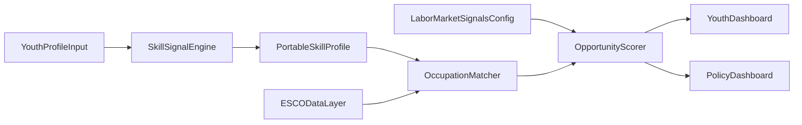

# Build Plan: ESCO Skills Matching + Opportunity Dashboard

## Objective
Implement a matching pipeline that takes a youth profile (skills + context) and returns realistic occupation opportunities, with visible labor-market evidence and explainable scoring.

## Inputs and Data Contracts
- **User profile input**
  - Education level
  - Free-text experience/tasks
  - Explicit selected skills
  - Optional constraints: location, wage needs, sector preference, mobility, language
- **Taxonomy backbone**
  - Use ESCO master tables from [backend_matching/data/esco](backend_matching/data/esco):
    - [backend_matching/data/esco/skills_en.csv](backend_matching/data/esco/skills_en.csv)
    - [backend_matching/data/esco/occupations_en.csv](backend_matching/data/esco/occupations_en.csv)
    - [backend_matching/data/esco/occupationSkillRelations_en.csv](backend_matching/data/esco/occupationSkillRelations_en.csv)
  - Use hierarchy/normalization helpers:
    - [backend_matching/data/esco/broaderRelationsSkillPillar_en.csv](backend_matching/data/esco/broaderRelationsSkillPillar_en.csv)
    - [backend_matching/data/esco/skillsHierarchy_en.csv](backend_matching/data/esco/skillsHierarchy_en.csv)
    - [backend_matching/data/esco/ISCOGroups_en.csv](backend_matching/data/esco/ISCOGroups_en.csv)

## Architecture (Country-Agnostic by Configuration)

- **Config-first design**
  - Country pack JSON/YAML for:
    - labor/econometric datasets and column mappings
    - education taxonomy mapping
    - signal weights and calibration
    - localization strings/language
    - opportunity types enabled (formal/informal/training/gig/self-employment)

## Module 1: Skills Signal Engine
- **Skill extraction and normalization**
  - Map free text and selected terms to ESCO `conceptUri` (skills).
  - Normalize synonyms via `preferredLabel/altLabels` from [backend_matching/data/esco/skills_en.csv](backend_matching/data/esco/skills_en.csv).
  - Use hierarchy (`broaderConceptUri`, broader-relations) to infer adjacent/generalized skills.
- **Confidence + provenance**
  - Keep per-skill confidence score and evidence source (`declared`, `inferred_from_text`, `inferred_from_experience`).
- **Portable profile output**
  - JSON profile with ESCO URIs, labels, skillType, reuseLevel, confidence, and explanation text for user readability.

## Module 3: Opportunity Matching Engine
- **Candidate generation**
  - Join user skill URIs with occupation-required skills from [backend_matching/data/esco/occupationSkillRelations_en.csv](backend_matching/data/esco/occupationSkillRelations_en.csv).
  - Aggregate matches per occupation URI from [backend_matching/data/esco/occupations_en.csv](backend_matching/data/esco/occupations_en.csv).
- **Scoring model (transparent)**
  - Base fit score:
    - essential-skill coverage (high weight)
    - optional-skill coverage (medium weight)
    - skill-distance penalty (if only broader/related skills matched)
  - Constraint modifiers:
    - education compatibility
    - language/location constraints
    - wage floor preference compatibility
- **Econometric evidence integration (required by brief)**
  - Show at least two user-visible signals in final ranking, e.g.:
    - sector/occupation wage signal
    - employment growth/absorption signal
    - returns-to-education signal
  - Signals must be visible as columns and explanation chips in UI, not hidden in model internals.

## Dashboard Design (Dual Interface)
- **Youth dashboard**
  - Top matched occupations with:
    - fit score breakdown
    - econometric signals (at least 2)
    - missing critical skills and “next best skill” recommendations
    - confidence / data freshness note
- **Policy dashboard**
  - Aggregates over users:
    - top demanded skills vs supplied skills gap
    - top matched occupations by region/segment
    - mismatch heatmaps by education level and sector
    - filter by demographic context and geography

## Data Layer and Processing Steps
- Build precomputed indices:
  - `skillUri -> occupations` (essential/optional split)
  - `occupationUri -> requiredSkills`
  - `occupationUri -> iscoGroup -> sector signals`
- Validate and cache:
  - normalize all URIs
  - deduplicate label variants
  - version and timestamp datasets for reproducibility

## Explainability and UX Requirements
- Every match should include:
  - why this occupation appears (matched skills list)
  - why ranked at this position (score decomposition)
  - what to improve next (highest-impact missing skills)
- Keep low-bandwidth mode:
  - server-side pagination
  - compact payloads with lazy detail expansion

## Delivery Milestones
- **M1**: ESCO ingestion + index build + profile schema
- **M2**: skill extraction/normalization + explanation generation
- **M3**: occupation scoring + ranking + calibration hooks
- **M4**: youth dashboard with visible econometric signals
- **M5**: policymaker dashboard aggregates and filters
- **M6**: country-pack switch demo for second context

## Initial Validation Plan
- Unit tests:
  - URI joins, scoring arithmetic, missing-data fallback
- Scenario tests:
  - “Amara-like” profile yields realistic occupations (not aspirational outliers)
- Governance checks:
  - fairness sanity checks across gender/education segments
  - explicit “no recommendation confidence” behavior when data is sparse
