# ESCO Entity Relationship Diagram

```mermaid
erDiagram
    OCCUPATIONS {
        string conceptUri PK
        string iscoGroup FK
        string preferredLabel
        string inScheme
        string code
    }

    ISCO_GROUPS {
        string conceptUri PK
        string code
        string preferredLabel
        string inScheme
    }

    SKILLS {
        string conceptUri PK
        string skillType
        string reuseLevel
        string preferredLabel
        string inScheme
    }

    SKILL_GROUPS {
        string conceptUri PK
        string code
        string preferredLabel
        string inScheme
    }

    OCCUPATION_SKILL_REL {
        string occupationUri FK
        string skillUri FK
        string relationType
        string skillType
    }

    SKILL_SKILL_REL {
        string originalSkillUri FK
        string relatedSkillUri FK
        string relationType
    }

    BROADER_OCC_REL {
        string conceptUri FK
        string broaderUri FK
        string conceptType
        string broaderType
    }

    BROADER_SKILL_REL {
        string conceptUri FK
        string broaderUri FK
        string conceptType
        string broaderType
    }

    CONCEPT_SCHEMES {
        string conceptSchemeUri PK
        string preferredLabel
        string hasTopConcept
    }

    DIGITAL_SKILLS_COLLECTION {
        string conceptUri FK
        string broaderConceptUri FK
    }

    DIGCOMP_SKILLS_COLLECTION {
        string conceptUri FK
        string broaderConceptUri FK
    }

    GREEN_SKILLS_COLLECTION {
        string conceptUri FK
        string broaderConceptUri FK
    }

    LANGUAGE_SKILLS_COLLECTION {
        string conceptUri FK
        string broaderConceptUri FK
    }

    RESEARCH_SKILLS_COLLECTION {
        string conceptUri FK
        string broaderConceptUri FK
    }

    TRANSVERSAL_SKILLS_COLLECTION {
        string conceptUri FK
        string broaderConceptUri FK
    }

    RESEARCH_OCCUPATIONS_COLLECTION {
        string conceptUri FK
        string broaderConceptUri FK
    }

    GREEN_SHARE_OCC {
        string conceptUri FK
        string code
        float greenShare
    }

    DICTIONARY {
        string filename
        string data_header
        string property
    }

    SKILLS_HIERARCHY {
        string level_0_uri
        string level_1_uri
        string level_2_uri
        string level_3_uri
    }

    OCCUPATIONS ||--o{ OCCUPATION_SKILL_REL : "occupationUri"
    SKILLS ||--o{ OCCUPATION_SKILL_REL : "skillUri"

    SKILLS ||--o{ SKILL_SKILL_REL : "originalSkillUri"
    SKILLS ||--o{ SKILL_SKILL_REL : "relatedSkillUri"

    OCCUPATIONS }o--|| ISCO_GROUPS : "iscoGroup -> code"

    OCCUPATIONS ||--o{ BROADER_OCC_REL : "conceptUri"
    ISCO_GROUPS ||--o{ BROADER_OCC_REL : "conceptUri/broaderUri"

    SKILLS ||--o{ BROADER_SKILL_REL : "conceptUri"
    SKILL_GROUPS ||--o{ BROADER_SKILL_REL : "conceptUri/broaderUri"

    SKILLS ||--o{ DIGITAL_SKILLS_COLLECTION : "conceptUri"
    SKILLS ||--o{ DIGCOMP_SKILLS_COLLECTION : "conceptUri"
    SKILLS ||--o{ GREEN_SKILLS_COLLECTION : "conceptUri"
    SKILLS ||--o{ LANGUAGE_SKILLS_COLLECTION : "conceptUri"
    SKILLS ||--o{ RESEARCH_SKILLS_COLLECTION : "conceptUri"
    SKILLS ||--o{ TRANSVERSAL_SKILLS_COLLECTION : "conceptUri"

    OCCUPATIONS ||--o{ RESEARCH_OCCUPATIONS_COLLECTION : "conceptUri"

    SKILL_GROUPS ||--o{ DIGITAL_SKILLS_COLLECTION : "broaderConceptUri"
    SKILL_GROUPS ||--o{ DIGCOMP_SKILLS_COLLECTION : "broaderConceptUri"
    SKILL_GROUPS ||--o{ GREEN_SKILLS_COLLECTION : "broaderConceptUri"
    SKILL_GROUPS ||--o{ LANGUAGE_SKILLS_COLLECTION : "broaderConceptUri"
    SKILL_GROUPS ||--o{ RESEARCH_SKILLS_COLLECTION : "broaderConceptUri"
    SKILL_GROUPS ||--o{ TRANSVERSAL_SKILLS_COLLECTION : "broaderConceptUri"
    ISCO_GROUPS ||--o{ RESEARCH_OCCUPATIONS_COLLECTION : "broaderConceptUri"

    ISCO_GROUPS ||--o{ GREEN_SHARE_OCC : "conceptUri/code"

    CONCEPT_SCHEMES ||--o{ OCCUPATIONS : "inScheme"
    CONCEPT_SCHEMES ||--o{ SKILLS : "inScheme"
    CONCEPT_SCHEMES ||--o{ SKILL_GROUPS : "inScheme"

    DICTIONARY }o--o{ OCCUPATIONS : "documents columns"
    DICTIONARY }o--o{ SKILLS : "documents columns"
    DICTIONARY }o--o{ OCCUPATION_SKILL_REL : "documents columns"
    DICTIONARY }o--o{ SKILL_SKILL_REL : "documents columns"

    SKILL_GROUPS ||--o{ SKILLS_HIERARCHY : "level n uri"
    SKILLS ||--o{ SKILLS_HIERARCHY : "level n uri"
```

## Notes

- The strongest join key across the ESCO files is `conceptUri` (or URI variants like `occupationUri`, `skillUri`, `broaderUri`).
- `occupationSkillRelations_en.csv` is the central bridge between occupations and skills.
- Collection files (`digital`, `green`, `research`, `language`, `transversal`, `digComp`) are filtered subsets of master data.
- `dictionary_en.csv` is metadata documentation for columns, not business entities.
